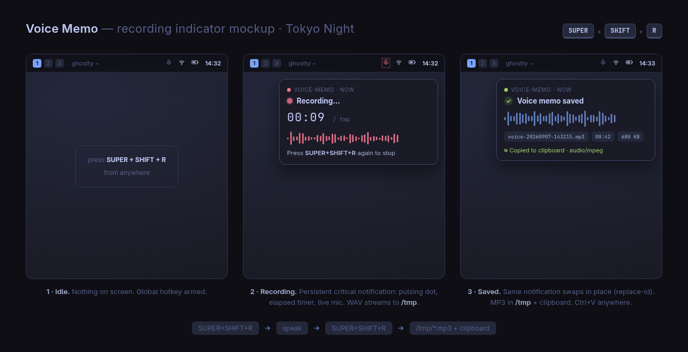

# voice-memo

One-hotkey voice memos for Omarchy / Hyprland, with **local transcription**.
Press once to start recording, press again to stop — you get an MP3 plus a
transcribed `.txt` in `~/Recordings/`, and the transcript text on the clipboard,
ready to paste anywhere. Transcription runs fully offline via
[voxtype](https://github.com/peteonrails/voxtype) (whisper.cpp).



## Usage

| Press | What happens |
|---|---|
| `SUPER+SHIFT+R` (1st) | Recording starts from the default mic; a persistent critical notification shows **● Recording…** |
| `SUPER+SHIFT+R` (2nd) | Recording stops → MP3 (`~/Recordings/voice-<timestamp>.mp3`) → **clipboard gets the file reference immediately** → local transcription → transcript saved as `.txt` next to the MP3 and **clipboard is replaced with the transcript text**; notification swaps to **Voice memo saved** with a text preview |

So the clipboard is two-stage: paste right away for the MP3 file, or wait ~1–2s
(after the "Transcribing…" swap) and paste the text. If transcription fails or no
speech is detected, the clipboard simply keeps the file reference.

Recordings live **only** in `~/Recordings/` (nothing in `/tmp` survives a reboot — this keeps them).

## Install

```bash
./install.sh
```

This symlinks `voice-memo` into `~/.local/bin` and checks dependencies.
Then add the binding to `~/.config/hypr/bindings.lua` (installer reminds you):

```lua
o.bind("SUPER + SHIFT + R", "Voice memo", "voice-memo")
```

Hyprland auto-reloads on save; verify with `hyprctl configerrors`.

## Dependencies

All stock on Omarchy: `pw-record` (PipeWire), `ffmpeg`, `wl-copy` (wl-clipboard), `omarchy` (notifications).
Transcription: `voxtype` (`omarchy voxtype install`).

### Transcription engine

Model and language are voxtype's own settings (`~/.config/voxtype/config.toml` or
`voxtype configure`). Default is the `base` whisper model with `language = "auto"`
(Italian, English, … are auto-detected). For better accuracy at the cost of speed,
download a bigger model, e.g. `small` or `large-v3-turbo`, and set `model = "small"`.

## How it works

- **Toggle script**: state file in `$XDG_RUNTIME_DIR` holds `<pid> <wav-path>`; presence of the file means "recording". An `flock` serializes rapid key presses.
- **Clean WAV**: recorder is stopped with `SIGINT` so `pw-record` finalizes the WAV header before exit.
- **Indicator**: `omarchy notification send -r 4210` — a fixed replace-id, so the "saved"/"transcribing" notifications swap in place instead of stacking. `-t 0` keeps it on screen while recording.
- **Transcription**: MP3 → 16 kHz mono WAV (what whisper wants) → `voxtype -q transcribe`; stdout noise lines are filtered, the rest is the transcript.
- **Clipboard**: two-stage — `text/uri-list` file reference the moment the MP3 exists, then replaced by the transcript text when transcription finishes (`VOICE_MEMO_CLIPBOARD=file` keeps the file reference).
- **Encoding**: `ffmpeg -codec:a libmp3lame -q:a 4` (VBR ~165 kbps).

## Configuration

| Env var | Default | Purpose |
|---|---|---|
| `VOICE_MEMO_DIR` | `~/Recordings` | Output directory |
| `VOICE_MEMO_TRANSCRIBE` | `1` | `0` disables transcription |
| `VOICE_MEMO_CLIPBOARD` | `text` | `text` = transcript, `file` = MP3 file reference |

## Mockup

`mockup/voice-memo-mockup.html` is the interactive design mockup (open in a browser).
